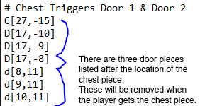

# Game-Jam 2020  
Ben Ranson & Henry Lewis Game-Jam 2020 git
## Our Game Idea  
The title of our game is "Some assembly required"  
The idea of this game is that you are a broken robot trying to re-assmble itself in some abandoned factory / laboratory.
 
It will be written in Java.
## How to modify our game  
You can modifiy most elements of our game, from using a custom map layout to using your own assets.

To make your own map, you will need a PNG file and a .cfg file (plain-text) both with the same name. 
The PNG file will be used to place walls, crates, etc. on the map - including floor tiles. The config file is used to determine the location of body parts and the doors they open up.  
 

 
You'll also need to place a single red-pixel (255 R, 0 B, 0G) on your map, this marks where the player spawns (the player spawns down and left of wherever you place this pixel)  
 
In the config file, you need to mark the location of a body part with:  
- H = Head
- A = Arm
- C = Chest
- L = Legs      

After each body part you should list the doors which you wish to be triggered (made to dissapear) after collection of the body part.

 
Coordinates are relative to the location of the command-block (marked by the red pixel) so coordinates up & left of this pixel are negative values and down & right are positive, with the command block itself being 0,0 always.